# Procesverslag
Markdown is een simpele manier om HTML te schrijven.  
Markdown cheat cheet: [Hulp bij het schrijven van Markdown](https://github.com/adam-p/markdown-here/wiki/Markdown-Cheatsheet).

Nb. De standaardstructuur en de spartaanse opmaak van de README.md zijn helemaal prima. Het gaat om de inhoud van je procesverslag. Besteedt de tijd voor pracht en praal aan je website.

Nb. Door *open* toe te voegen aan een *details* element kun je deze standaard open zetten. Fijn om dat steeds voor de relevante stuk(ken) te doen.

## Jij

  
uitwerken voor kick-off werkgroep

  ### Auteur:
  Lantijn Bergman

  #### Je startniveau:
  Blauw / Rood

  #### Je focus:
  Responsive
 

## Je website

  
Youtube.com

  ### Je opdracht:
  Ik ga Youtube namaken met HTML, CSS en JavaScript. Het is de bedoeling dat mijn site nagenoeg identiek is aan het orgineel. Mijn focus ligt op het responsive maken van de website, zodat de site op verschillende devices te gebruiken is. 

  #### Screenshot(s) van de eerste pagina (small screen): 
  Youtube homepage
  
  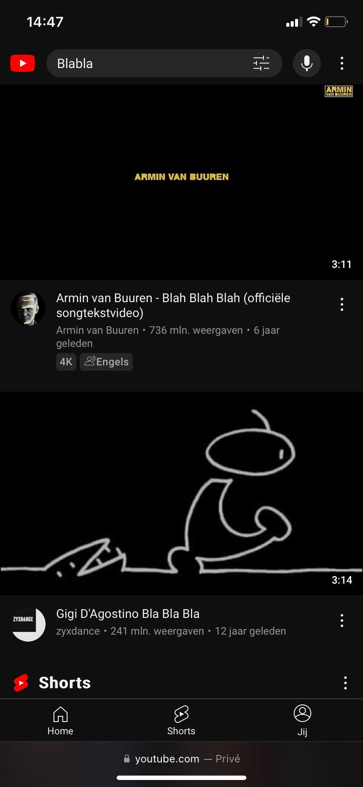

  #### Screenshot(s) van de tweede pagina (small screen):
  Youtube videoplayer
  
  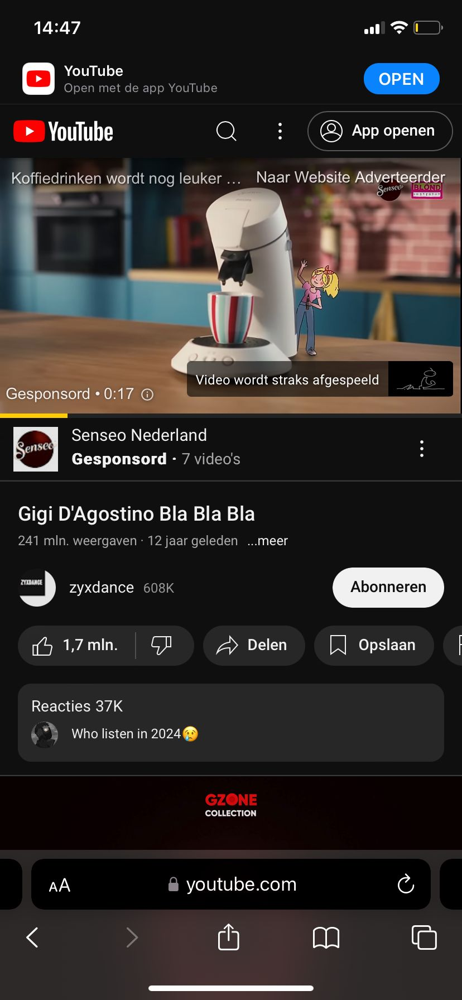
 

## Toegankelijkheidstest 1/2 (week 1)

  
uitwerken na test in 2e werkgroep

  ### Bevindingen
Youtube is erg toegankelijk voor gebruikers met een handicap. Ik heb niet heel veel ervaring met een screenreader maar naar mijn mening is youtube er prima mee te gebruiken. Er zijn nog een paar HTML elementen die verbeterd kunnen worden zoals lists gebruiken voor een aantal elementen en headings geven. Ik heb foto's van mijn toegankelijksheidstestformulier bij Toegankelijkheidstest 2/2 (week 4) geplaatst.

## Breakdownschets (week 1)

  
uitwerken na afloop 3e werkgroep

  ### de hele pagina: 
  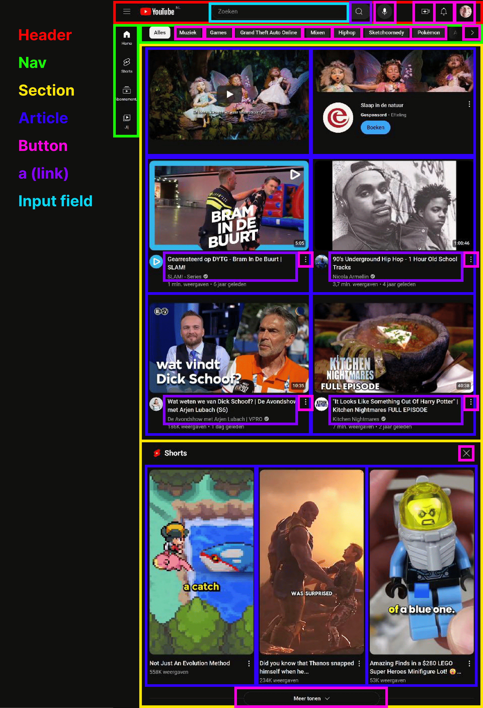

  ### dynamisch deel (bijv menu): 
  

  ### wellicht nog een dynamisch deel (bijv filter): 
  

## Voortgang 1 (week 2)

  
uitwerken voor 1e voortgang

  ### Stand van zaken
 Het lukte me goed om de basis HTML te verwerken en heb al en goed idee over hoe ik het wil gaan stylen met CSS. Ik weet alleen nog niet precies hoe ik een grid gebruik om mijn video's te laten zien. Ook heb ik geen idee over hoe ik de header mooi ga krijgen. Ik heb ook alle icoontjes in illustrator gemaakt.

  ### Verslag van meeting
  hier na afloop snel de uitkomsten van de meeting vastleggen

  - Ik ga de grid opdracht maken daarmee kan ik leren hoe ik mijn videomain kan maken
  - Gebruik SVG inplaats van PNG voor de iconen
  - Gebruik een aside en een form voor de header inplaats van een div
  - Maak veel meer gebruik van li voor dingen die eigenlijk in een lijst staan

    Hier kan je zien hoe ik gebruik heb gemaakt van een grid om de homepage te stijlen
    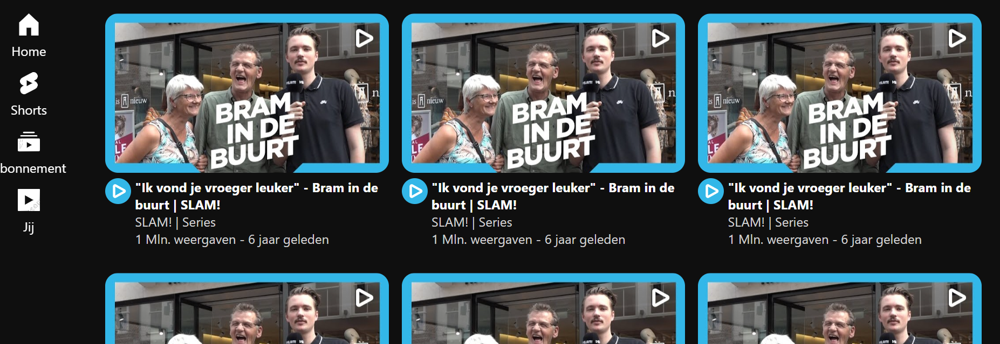

    Dit is hoe de header eruit ziet en ik hier gebruik gemaakt van een aside, form en een ul
    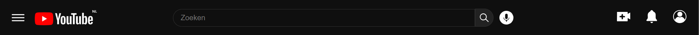

## Voortgang 2 (week 3)

  
uitwerken voor 2e voortgang

  ### Stand van zaken
 Het gaat goed met de website. De HTML is voor het grootste deel af en ik ben lekker bezig met de CSS. Dingen als grid en flexbox heb ik begrepen om daarmee de website vorm te geven. Sommige dingen lukken nog niet maar daar maak ik een lijstje met vragen voor in de les.

  ### Verslag van meeting
  hier na afloop snel de uitkomsten van de meeting vastleggen

  - Het is gelukt om de nav in de main te zetten en in dezelfde grid als de video's zo neemt het altijd dezelfde ruimte in en blijft het responsive als je de site kleiner maakt.
  - Header moet op position: fixed om bovenaan te blijven tijdens het scrollen
  - Overflow-X gebruiken om categoriën horizontaal te laten scrollen
  - Ik moet mediaquery gebruiken voor mobiel formaat
  - Custom properties gebruiken voor de kleuren 

## Toegankelijkheidstest 2/2 (week 4)

  
uitwerken na test in 9e werkgroep

Toegankelijkheidstest pagina 1
  
  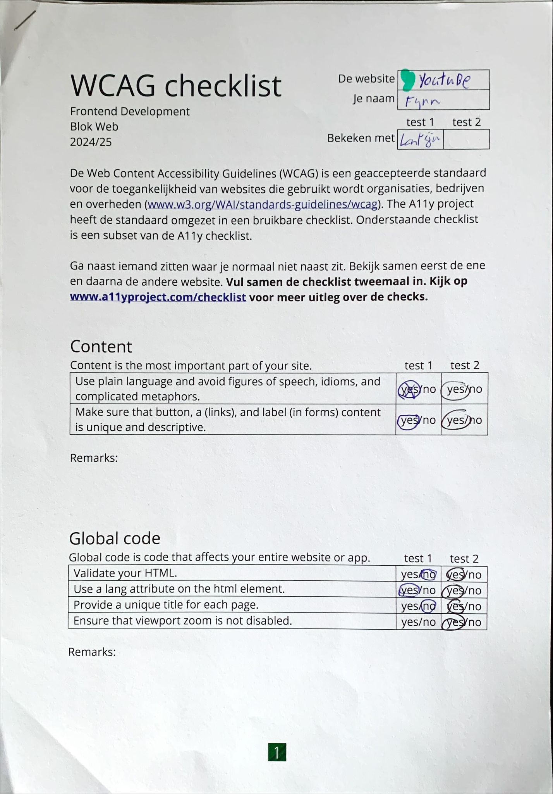

  Toegankelijkheidstest pagina 2

  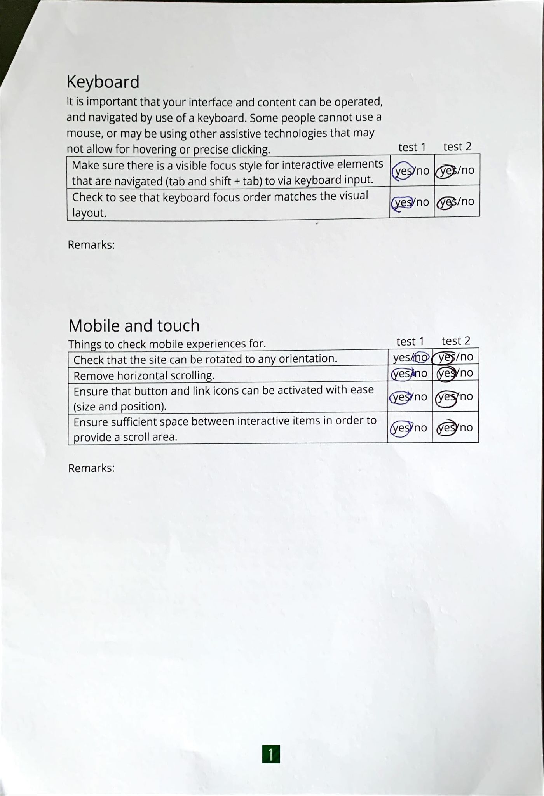

  Toegankelijkheidstest pagina 3

  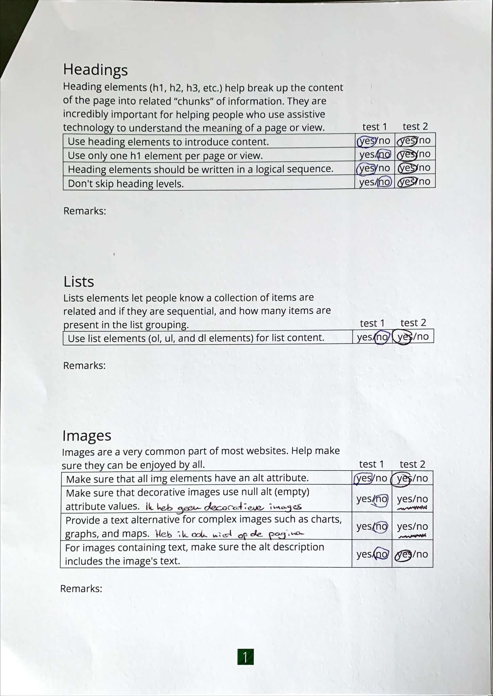

  Toegankelijkheidstest pagina 4

  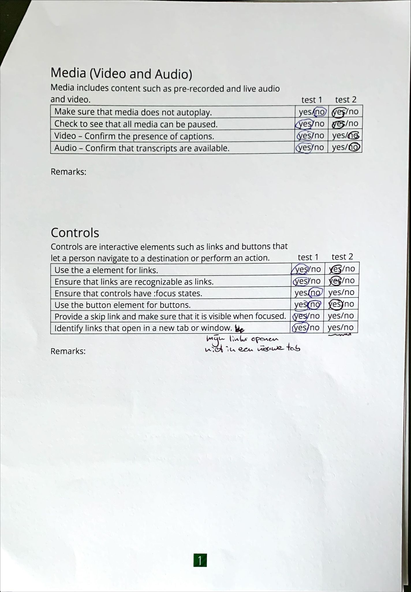

  Toegankelijkheidstest pagina 5

  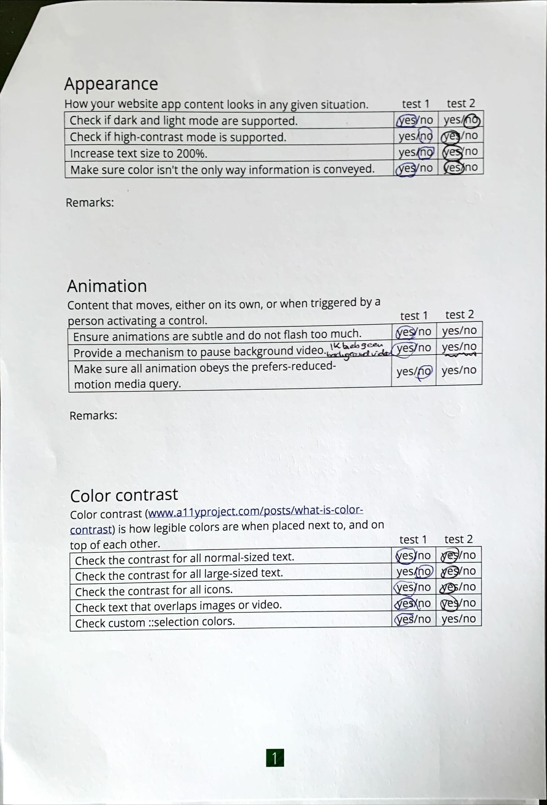

  ### Bevindingen
  Aangezien Youtube al toegankelijk is heb ik niet perse verbeteringen hieraan gebrachtop aan de toegankelijkheid, de code kon wel semantischer geschreven worden dus dat heb ik gedaan. Mijn HTML is semantisch en ik heb headings gebruikt waar dat nodig is. Ik op de homepage ook een h1 gebruikt maar onzichtbaar gemaakt, zodat het voor een screenreader wel werkt maar niet afleid voor gebruikers die wel kunnen zien. Ik heb doormiddel van de juiste attributen de toegankelijkheid verbeterd. Ik heb gebruik gemaakt van section, article, headings, form, aside, a en ul's om het zo semantisch mogelijk te houden en heb alleen voor de vormgeving af en toe een div gebruikt, ik heb ook zo min mogelijk class gebruikt.

## Voortgang 3 (week 4)

  
uitwerken voor 3e voortgang

  ### Stand van zaken
  De website oogt indentiek aan de orginele Youtube, dus dat gaat erg goed. Ik heb nog een paar dingen die ik moet fixen, zoals een werkend hamburger menu, hoe ik de nav onderaan krijg met mediaquerry en wat responsive dingetjes zoals dat de iconen en de video goed meeschalen.

  ### Verslag van meeting
  hier na afloop snel de uitkomsten van de meeting vastleggen

  - nav flex-direction row geven, position fixed en bottom 0, bij een bepaalde max-width. Zo gaat de nav onderaan staan op mobiel formaat
  - Hamburger menu werkt met JavaScript, ik zet het menu normaal op display none en met JavaScript als je erop klikt veranderd het naar display block
  - Geef de video width 100% met een mediaquerry 
  - Gebruik justify-content: space around om bepaalde elementen netjes te centreren en goed responsive te maken, zoals de nav en de header.
  - Met mediaquerry kan je veel dingen doen, ik heb bijvoorbeeld een mobiel formaat gemaakt door alle mobiele elementen op display: none te zetten en vanaf een bepaalde width zet ik ze op display block en dan zet ik de desktop elementen op display none
  - 

## Eindgesprek (week 5)

  
uitwerken voor eindgesprek

  ### Je uitkomst - karakteristiek screenshots:
  Homepage desktop formaat
  
  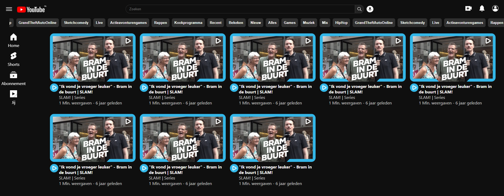
  
  Videoplayer desktop formaat
  
  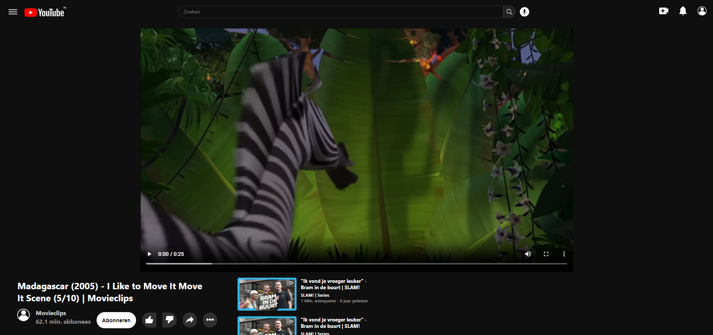

  Homepage mobiel formaat
  
  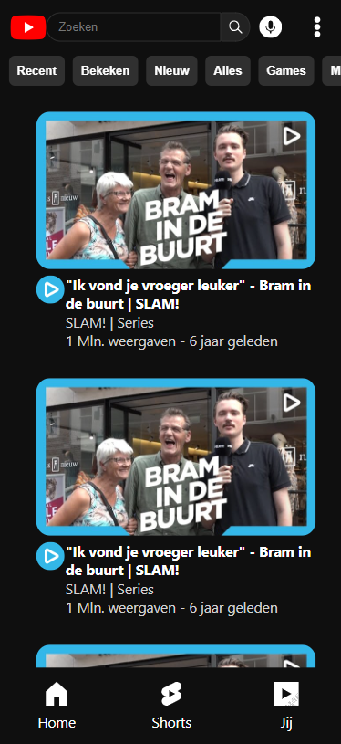  
  
  Videoplayer mobiel formaat
  
  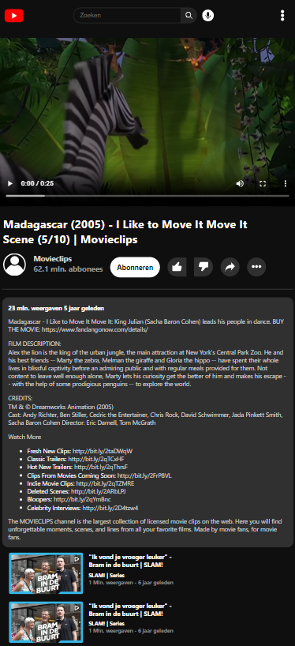

  ### Dit ging goed/Heb ik geleerd: 
  Korte omschrijving met plaatjes

  

  ### Dit was lastig/Is niet gelukt:
  Korte omschrijving met plaatjes

  

## Bronnenlijst

  
continu bijhouden terwijl je werkt

  Nb. Wees specifiek ('css-tricks' als bron is bijv. niet specifiek genoeg). 
  Nb. ChatGpT en andere AI horen er ook bij.
  Nb. Vermeld de bronnen ook in je code.

  1. Youtube tutorial over mediaquerries gekeken https://www.youtube.com/watch?v=yU7jJ3NbPdA&ab_channel=WebDevSimplified
  2. Voorderest heb ik alles uit de les
  3. ...

